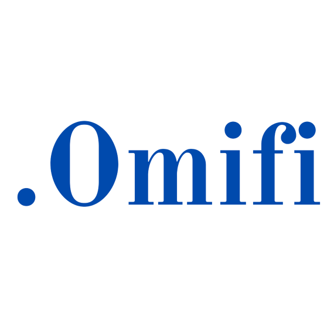
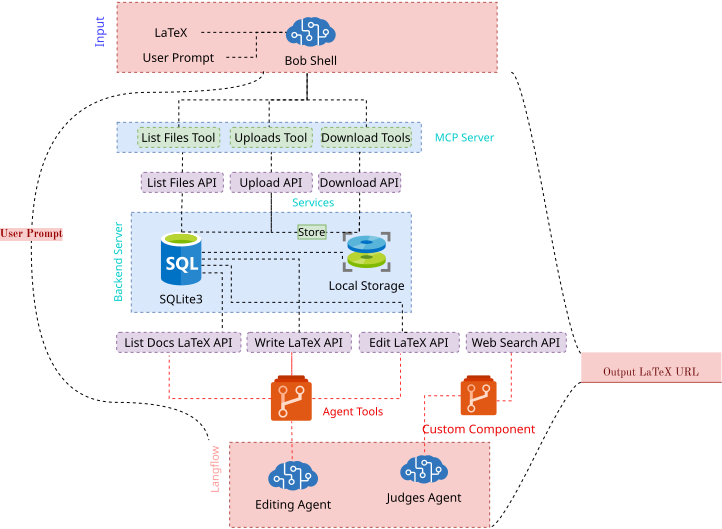

<p align="center">
  
</p>

<h1 align="center">Omifi</h1>

<p align="center">
  A deterministic backend for LaTeX resumes, cover letters, versioning, PDF
  generation, and resume evaluation.
</p>

## Overview

Omifi accepts LaTeX source, stores immutable document versions, validates and
compiles source into PDF artifacts, and stores structured judge reports.
Langflow runs in its existing environment and communicates with the backend
over HTTP.



## Quick start

```bash
uv sync
cp .env.example .env
uv run uvicorn app.main:app --reload --host 0.0.0.0 --port 8080
```

The API is available at `http://localhost:8080`. The health endpoint does not
require an API key. If `CV_INTERNAL_API_KEY` is configured, send it in the
`X-API-Key` header for internal endpoints.

PDF generation requires the executable configured by `CV_LATEX_ENGINE`
(`xelatex` by default). If the compiler is unavailable, Omifi still stores the
source and version with an `unavailable` compile status.

## Docker

The Docker image installs the Python dependencies and XeLaTeX:

```bash
cp .env.example .env
docker compose up --build
```

SQLite data and generated artifacts are stored in the `cv-data` Docker volume.
Stop the service with `docker compose down`. Use `docker compose down -v` only
when you also want to remove the database and artifacts.

## Langflow and MCP

Run the existing Langflow environment with the Omifi components:

```bash
LANGFLOW_COMPONENTS_PATH="$PWD/langflow_components/cv_automation" \
  .venv-langflow/bin/langflow run
```

The editing component provides `get_context`, `check_latex`, `edit_latex`, and
`write_latex`. The judges component provides `get_context`, `search_web`, and
`save_report`. Tavily credentials must remain in the Langflow environment.

Run the Bob Shell file gateway over stdio:

```bash
uv run python -m app.mcp_server
```

The gateway exposes `upload_file`, `list_files`, and `download_file`. Upload
content uses `content_base64`; download content must be decoded from
`content_base64`. There is no `read_file` tool.

The native Langflow MCP tools are `editing_flow` and `judges_flow`. Both accept
`{input_value: JSON.stringify(payload)}`. The complete contracts and examples
are available in [Editing Flow](langflow_flows/editing_flow.md) and
[Judges Flow](langflow_flows/judges_flow.md).

When creating a document, submit exactly one of `file_id` or complete
`source_latex`. For a cover letter, use `document_name: "cover-letter.tex"`.
Always preserve the returned `document_id` and `latest_version_id`; never
invent IDs or convert a `file_...` ID into a `doc_...` ID.

After changing components or flow contracts, synchronize saved flows:

```bash
uv run python scripts/sync_langflow.py --apply
```

Use `CV_LANGFLOW_URL`, `CV_LANGFLOW_API_KEY`, and `CV_LANGFLOW_PROJECT_ID` from
your local environment. Reconnect Bob's native MCP connection after syncing.

## API

- `POST /v1/files`
- `GET /v1/files` and `GET /v1/files/{file_id}/download`
- `POST /v1/documents` and `GET /v1/documents/{document_id}`
- `POST /v1/documents/{document_id}/versions`
- `POST /v1/documents/{document_id}/check-latex`
- `POST /v1/documents/{document_id}/render`
- `POST /v1/documents/{document_id}/reports`
- `GET /v1/artifacts/{artifact_id}/preview`
- `GET /v1/artifacts/{artifact_id}/download`

All errors use the envelope
`{"error": {"code": "...", "message": "...", "details": {}}}`.

## Documentation and assets

- [System design](docs/omifi-system-design-prd.md)
- [End-to-end test guide](docs/omifi-e2e.md)
- [Editing flow definition](docs/editing-flow.json)
- [Judges flow definition](docs/judges-flow.json)
- [Documentation assets](docs/assets/)

## Validation

```bash
uv run pytest -q
uv run python -m compileall -q app langflow_components langflow_flows tests
uv lock --check
```
