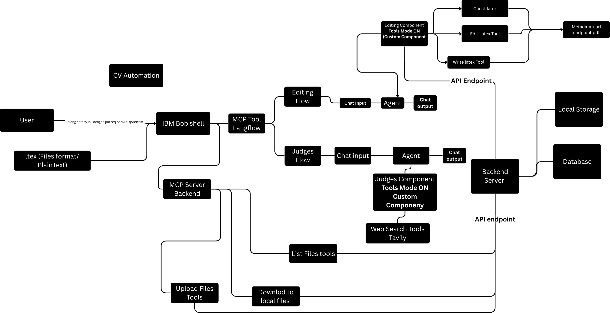
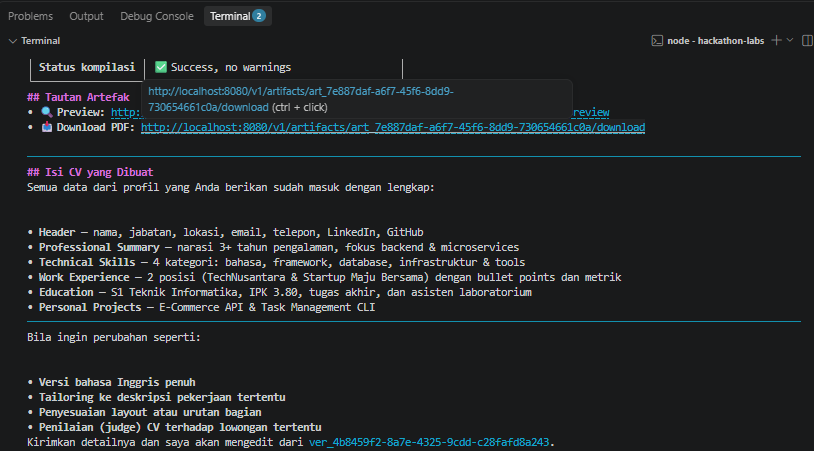
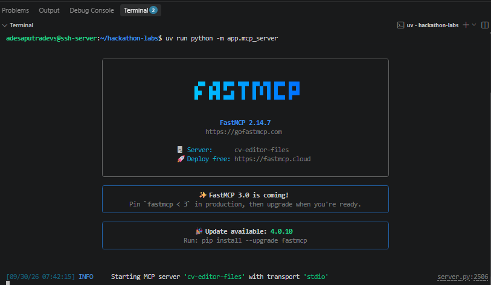
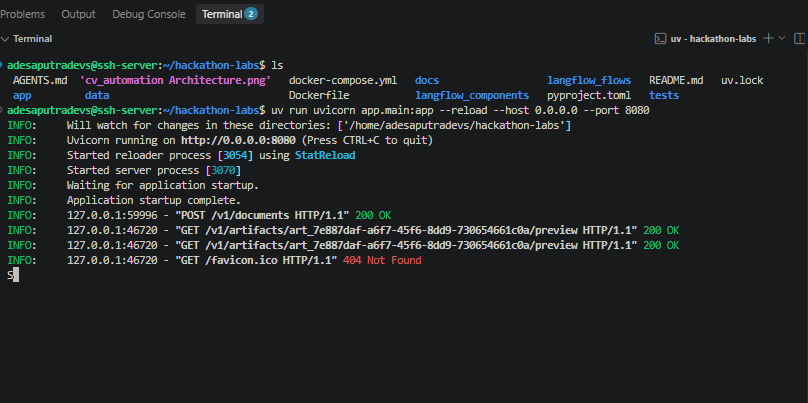
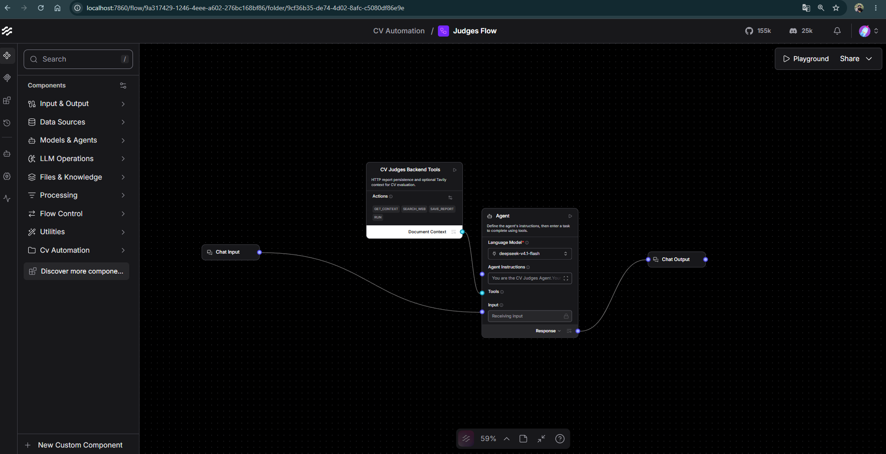
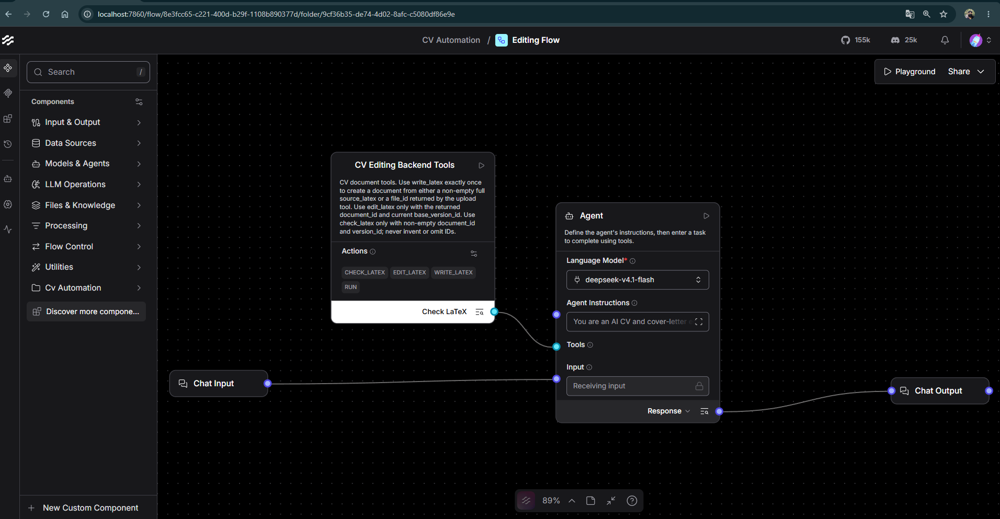
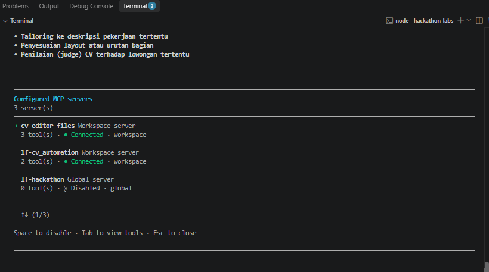

# Omifi End-to-End Test Guide

This guide verifies the complete backend flow after XeLaTeX is installed:

```text
Upload resume → Create document → Edit version → Check and compile
→ Render PDF → Save judge report → Download artifact
```

## Visual map of the test flow



This architecture image shows which system owns each step. Bob and Langflow
coordinate the request, while the backend stores the document, versions,
reports, and generated artifacts. The E2E commands below exercise the backend
side of that path directly.



This workflow image shows the expected product result: source becomes a
versioned document, the selected version becomes a PDF, and the same version
receives a judge report.

## Prerequisites

Run these commands from the repository root:

```bash
uv sync
if [ ! -f .env ]; then cp .env.example .env; fi
xelatex --version
curl --version
command -v xelatex
```

The backend uses `CV_LATEX_ENGINE=xelatex` by default. If
`CV_INTERNAL_API_KEY` is configured, export the same value for this test:

```bash
export API_KEY='your-shared-api-key'
```

Leave `API_KEY` unset when authentication is disabled.

## 1. Start the backend



The backend API is the system under test in this guide. It is responsible for
authentication, document state, version creation, compilation, artifact
access, and report persistence.

In a first terminal:

```bash
uv run uvicorn app.main:app --reload --host 0.0.0.0 --port 8080
```

In a second terminal:

```bash
export API_URL='http://localhost:8080'
AUTH_ARGS=()
if [ -n "${API_KEY:-}" ]; then
  AUTH_ARGS=(-H "X-API-Key: ${API_KEY}")
fi
curl -fsS "$API_URL/health"
```

Expected response:

```json
{"status":"ok"}
```

## 2. Upload resume source



In the integrated product, Bob reaches the upload and download endpoints
through this file gateway. This guide uses `curl` so the same backend
contract can be tested without requiring a running Bob session.

Create a small LaTeX smoke-test file in `/tmp`:

```bash
cat > /tmp/omifi-e2e.tex <<'EOF'
\documentclass{article}
\begin{document}
Omifi E2E Test
\end{document}
EOF
```

Upload the file and save the response:

```bash
UPLOAD_RESPONSE=$(curl -fsS "${AUTH_ARGS[@]}" \
  -F 'file=@/tmp/omifi-e2e.tex;type=text/x-tex' \
  "$API_URL/v1/files")
printf '%s\n' "$UPLOAD_RESPONSE"

export FILE_ID=$(printf '%s' "$UPLOAD_RESPONSE" | uv run python -c \
  'import json, sys; print(json.load(sys.stdin)["file_id"])')
printf 'FILE_ID=%s\n' "$FILE_ID"
```

The response must include `file_id`, `filename`, `size_bytes`, and `sha256`.

## 3. Create the initial document and version

Create a document from the uploaded file:

```bash
DOC_PAYLOAD=$(uv run python -c 'import json, os; print(json.dumps({
  "name": "omifi-e2e.tex",
  "file_id": os.environ["FILE_ID"],
  "change_summary": "Initial E2E source"
}))')

DOC_RESPONSE=$(curl -fsS "${AUTH_ARGS[@]}" \
  -H 'Content-Type: application/json' \
  -d "$DOC_PAYLOAD" \
  "$API_URL/v1/documents")
printf '%s\n' "$DOC_RESPONSE"

export DOC_ID=$(printf '%s' "$DOC_RESPONSE" | uv run python -c \
  'import json, sys; print(json.load(sys.stdin)["document_id"])')
export VERSION_ID=$(printf '%s' "$DOC_RESPONSE" | uv run python -c \
  'import json, sys; print(json.load(sys.stdin)["latest_version_id"])')
printf 'DOC_ID=%s\nVERSION_ID=%s\n' "$DOC_ID" "$VERSION_ID"
```

With XeLaTeX available, the initial version should have
`compile_status: "success"` and a PDF in `latest_version.artifacts`.

## 4. Check and compile the source



The editing flow normally decides when to retrieve context, validate LaTeX,
or save a replacement. This section tests the validation and compilation
operation that the flow ultimately calls.

Run validation and a dry-run compilation:

```bash
CHECK_PAYLOAD=$(uv run python -c 'import json, os; print(json.dumps({
  "version_id": os.environ["VERSION_ID"],
  "dry_run_compile": True
}))')

CHECK_RESPONSE=$(curl -fsS "${AUTH_ARGS[@]}" \
  -H 'Content-Type: application/json' \
  -d "$CHECK_PAYLOAD" \
  "$API_URL/v1/documents/$DOC_ID/check-latex")
printf '%s\n' "$CHECK_RESPONSE"
```

Expected values:

```json
{
  "valid": true,
  "compile_status": "success",
  "errors": []
}
```

## 5. Edit the source and create a new version

The version endpoint accepts a complete source replacement. The previous
version remains unchanged:

```bash
export EDITED_SOURCE='\documentclass{article}
\begin{document}
Omifi E2E Test - Updated
\end{document}'

EDIT_PAYLOAD=$(uv run python -c 'import json, os; print(json.dumps({
  "base_version_id": os.environ["VERSION_ID"],
  "source_latex": os.environ["EDITED_SOURCE"],
  "change_summary": "Update E2E source"
}))')

EDIT_RESPONSE=$(curl -fsS "${AUTH_ARGS[@]}" \
  -H 'Content-Type: application/json' \
  -d "$EDIT_PAYLOAD" \
  "$API_URL/v1/documents/$DOC_ID/versions")
printf '%s\n' "$EDIT_RESPONSE"

export VERSION_ID=$(printf '%s' "$EDIT_RESPONSE" | uv run python -c \
  'import json, sys; print(json.load(sys.stdin)["latest_version_id"])')
printf 'UPDATED_VERSION_ID=%s\n' "$VERSION_ID"
```

The response must include two versions and a new `latest_version_id`.

## 6. Render and download the PDF

Render the latest version:

```bash
RENDER_PAYLOAD=$(uv run python -c 'import json, os; print(json.dumps({
  "version_id": os.environ["VERSION_ID"]
}))')

RENDER_RESPONSE=$(curl -fsS "${AUTH_ARGS[@]}" \
  -H 'Content-Type: application/json' \
  -d "$RENDER_PAYLOAD" \
  "$API_URL/v1/documents/$DOC_ID/render")
printf '%s\n' "$RENDER_RESPONSE"

export ARTIFACT_ID=$(printf '%s' "$RENDER_RESPONSE" | uv run python -c \
  'import json, sys; print(json.load(sys.stdin)["version"]["artifacts"][0]["artifact_id"])')
printf 'ARTIFACT_ID=%s\n' "$ARTIFACT_ID"
```

Download and verify the PDF:

```bash
curl -fsS "${AUTH_ARGS[@]}" \
  -o /tmp/omifi-e2e.pdf \
  "$API_URL/v1/artifacts/$ARTIFACT_ID/download"

file /tmp/omifi-e2e.pdf
test "$(file --brief --mime-type /tmp/omifi-e2e.pdf)" = 'application/pdf'
```

## 7. Save a judge report



The judging flow evaluates a selected document version against a job
description. The report is stored by version, so later edits do not change the
evidence for an earlier evaluation.

Save a report for the rendered version:

```bash
REPORT_PAYLOAD=$(uv run python -c 'import json, os; print(json.dumps({
  "version_id": os.environ["VERSION_ID"],
  "job_description": "Backend Python developer",
  "scores": {"ats": 80, "requirements": 75, "quality": 90},
  "evidence": [{"source": "cv", "text": "Omifi E2E Test - Updated"}],
  "gaps": ["Add measurable project impact"],
  "recommendations": ["Add keywords from the job description"],
  "warnings": []
}))')

REPORT_RESPONSE=$(curl -fsS "${AUTH_ARGS[@]}" \
  -H 'Content-Type: application/json' \
  -d "$REPORT_PAYLOAD" \
  "$API_URL/v1/documents/$DOC_ID/reports")
printf '%s\n' "$REPORT_RESPONSE"
```

The response must include `report_id`, `document_version_id`, and the
`ats`, `requirements`, and `quality` scores.

## 8. Verify the final state

Retrieve the document, all versions, and artifacts:

```bash
curl -fsS "${AUTH_ARGS[@]}" "$API_URL/v1/documents/$DOC_ID"
```

Success checklist:

- `xelatex --version` succeeds.
- Upload returns a `file_id`.
- The document has at least two versions after editing.
- The latest version has `compile_status: "success"`.
- The PDF artifact is `ready` and downloadable.
- The judge report contains ATS, requirements, and quality scores.

## Automated validation

The manual flow uses a real server and XeLaTeX. Run the automated checks too:

```bash
uv run pytest -q
uv run python -m compileall -q app langflow_components langflow_flows tests
uv lock --check
```

The test suite does not require XeLaTeX because compiler tests use a fake
compiler or a monkeypatch.

## Troubleshooting

### `EXTERNAL_TOOL_UNAVAILABLE`

Run `command -v xelatex` and confirm that the `PATH` visible to Uvicorn matches
your shell. Also verify `CV_LATEX_ENGINE` in `.env`.

### Artifact URL is inaccessible

Check `CV_PUBLIC_BASE_URL` and confirm that it points to the host and port
where the backend is running. Direct artifact downloads still require the API
key when authentication is enabled.

## Full Langflow and MCP flow



This runtime image shows the complete integration boundary. Bob starts the
request, Langflow selects and runs the appropriate flow, and Omifi returns the
authoritative document, version, artifact, and report data.

After the backend E2E flow succeeds, run the integration components in the
existing Langflow environment described by the system design document. Bob
Shell uses `.bob/mcp.json` to start the MCP file gateway. Upload a `.tex` file
through MCP, ask the editing component to persist a complete source
replacement, then ask the judges component to save a report. Verify the final
document and artifact through the API.
